# Automatic Water Dispenser

**Build timeline:** May 24, 2026 – August 6, 2026

An Arduino-based system that automatically presses a water dispenser button and detects when a bottle is full, using an ultrasonic sensor and a servo motor.

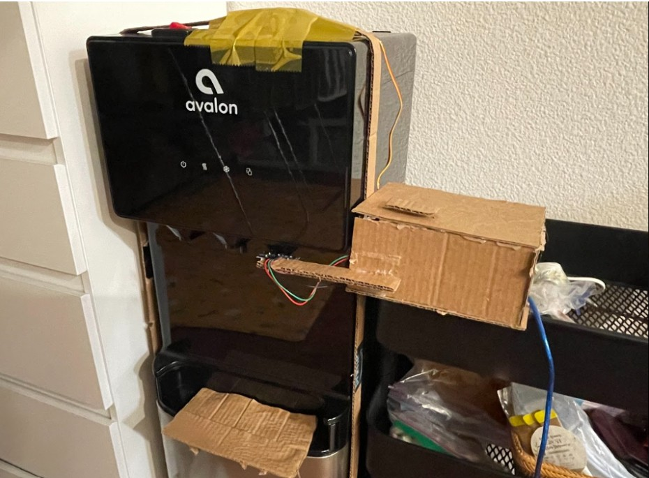

## Overview

**Purpose:** A gadget that automatically dispenses water by pushing down on the dispenser when I press a button, and detects when the bottle is full.

**Problem it solves:** I tend to wake up with just enough time on school mornings, and it becomes a hassle to wait around while my bottle fills. This project saves me time by letting me do other things to get ready while the bottle fills itself.

**Success criteria:** When I press the button, it dispenses water until the bottle is full, then automatically stops.

**Planned features:** A screen that displays bottle fill percentage in real time using the ultrasonic sensor and an LCD, with the option to fill to preset levels (25%, 50%, 75%).

## System Architecture

### Materials

| Material | Cost |
|---|---|
| Button | Already had |
| Ultrasonic sensor (HC-SR04), 2pc | $6.99 |
| Servo motor | Already had |
| Arduino | Already had |
| Breadboard | Already had |
| Cardboard | From work |
| Glue gun | Already had |
| 20kg torque servo motor | $21.97 |
| **Total** | **$28.96** |

### Design Sketch

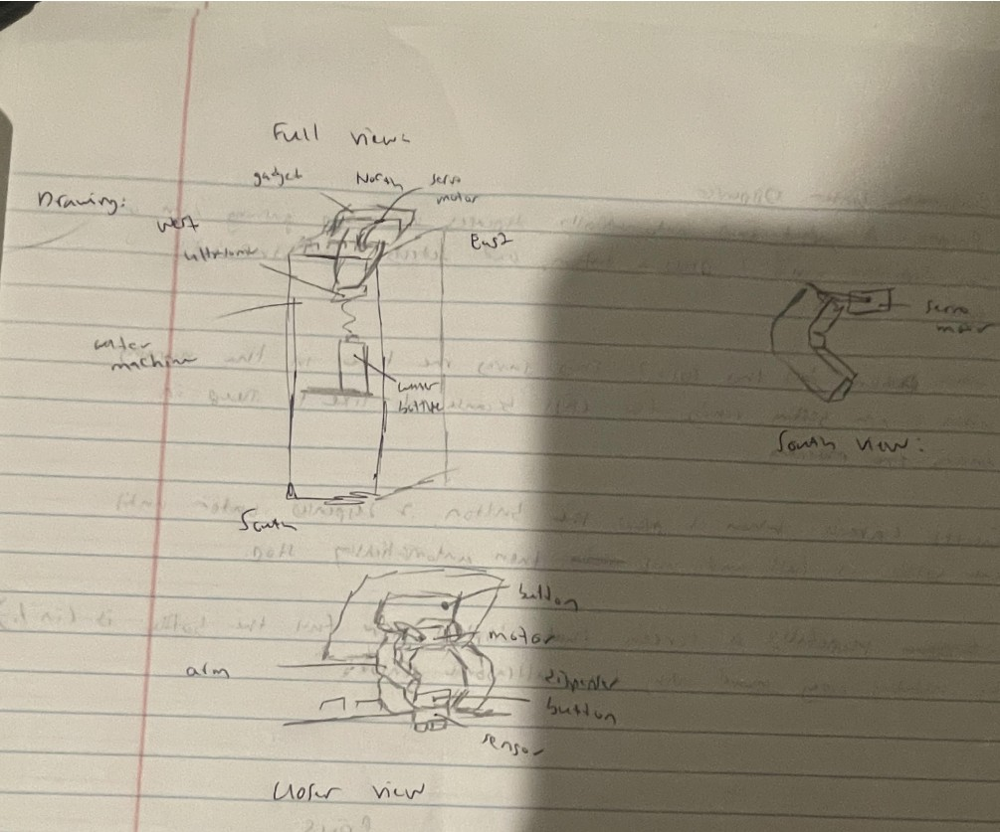

## Hardware Design

### Electrical (6/4/26)

The circuit controls the whole project: receiving the button press, detecting when the bottle is full via the ultrasonic sensor, and driving the servo to press the dispenser button.

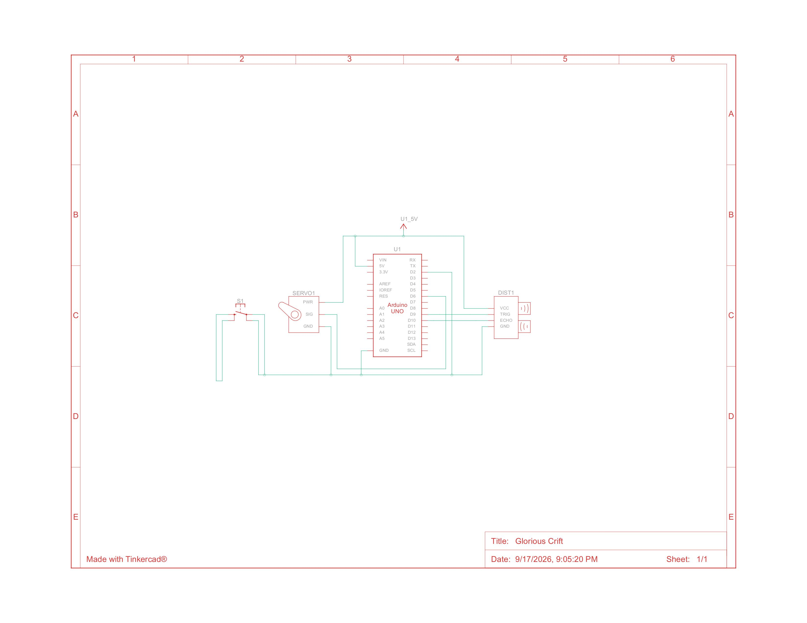

[Video Demonstration](https://drive.google.com/file/d/1dckeszdpzdRObbhAMEDrqvppLTZZscEZ/view?usp=sharing)

> Note: the video uses a 2cm threshold as a placeholder. Referenced "the code not ending" — it runs through an if-loop, waiting for the button to be pressed again.

**Challenges:** This was my first time working with multiple modules, let alone using an Arduino at all, so there was a steep learning curve. Understanding how a breadboard's underside connects terminals — and watching tutorials on wiring modules individually before combining them — was what got me past it.

### Mechanical

The electrical, mechanical, and software pieces come together here to bring the dispenser to life.

**Arm mechanism:**

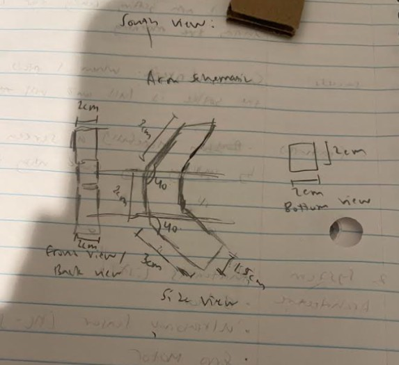
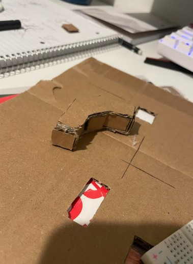
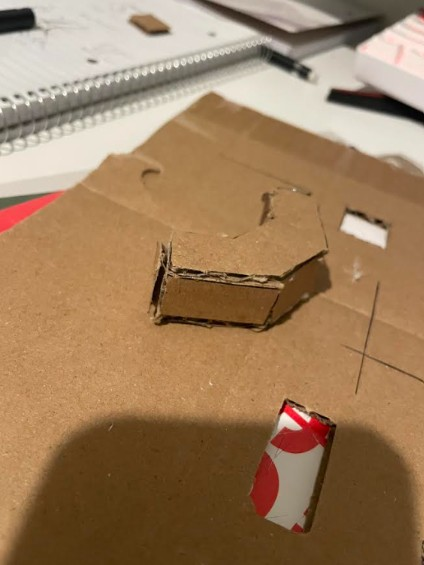

**6/18/26 — Big problem:** The original servo was too weak to push the dispenser's button, so I upgraded to a 20kg torque servo motor — likely overkill, but it gets the job done.

That introduced a new problem: the stronger motor needed to be held down while it worked, requiring more force than I could apply manually. I considered:
- A rack-and-pinion — too complex to build with just cardboard and no CAD/3D printing access
- Suction cups — unlikely to hold under the actuation force

**6/30/26:** Decided to defer the button-pressing solution and focus on the rest of the hardware build in the meantime.

**7/7/26:**

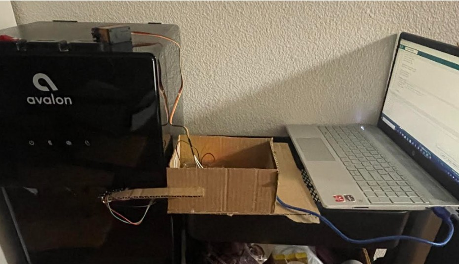

- Noticed the ultrasonic sensor sometimes read random close-together values, stopping the program early even when the bottle wasn't full. Fixed by only triggering a stop when a distance of ≤4cm is read twice in a row.

**8/6/26:**
- Finished the housing box and added a top. Fixed the sonar mount by using two support planks instead of one — the original was too limp and ended up reading the side of the bottle instead of the water.
- Added a button to the outside of the box for easier access.

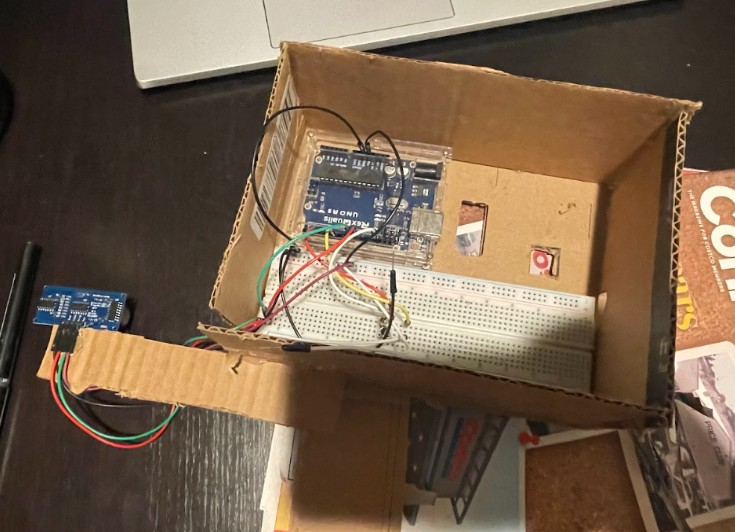
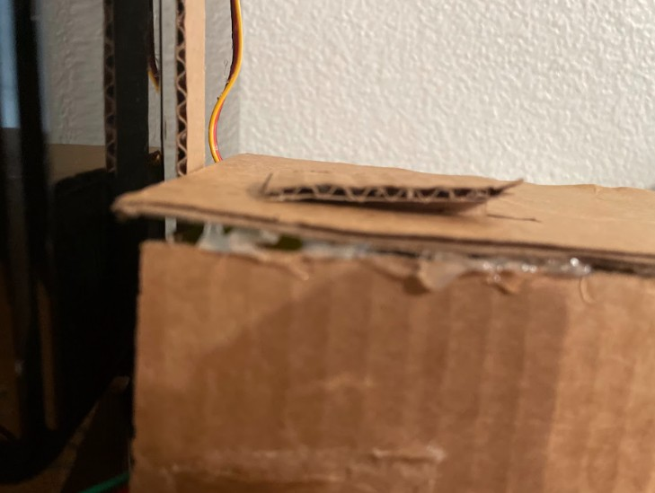

**Tilted bottle platform:**

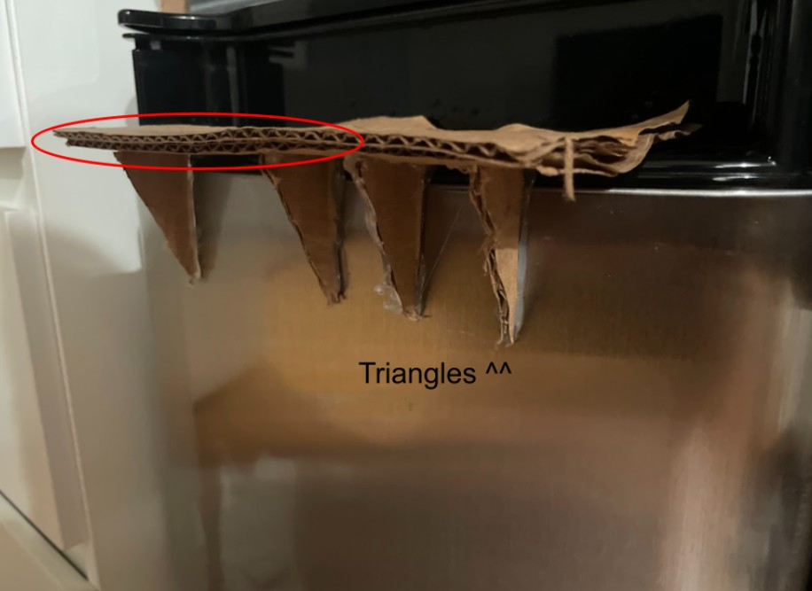

- Designed the platform to tilt the bottle forward at an angle, since the nozzle didn't extend far enough for the bottle to sit upright and still catch the water.
- Added triangular supports underneath since the platform needed extra structural support to hold the bottle's weight.

**Securing the motor — the main challenge of the project:**

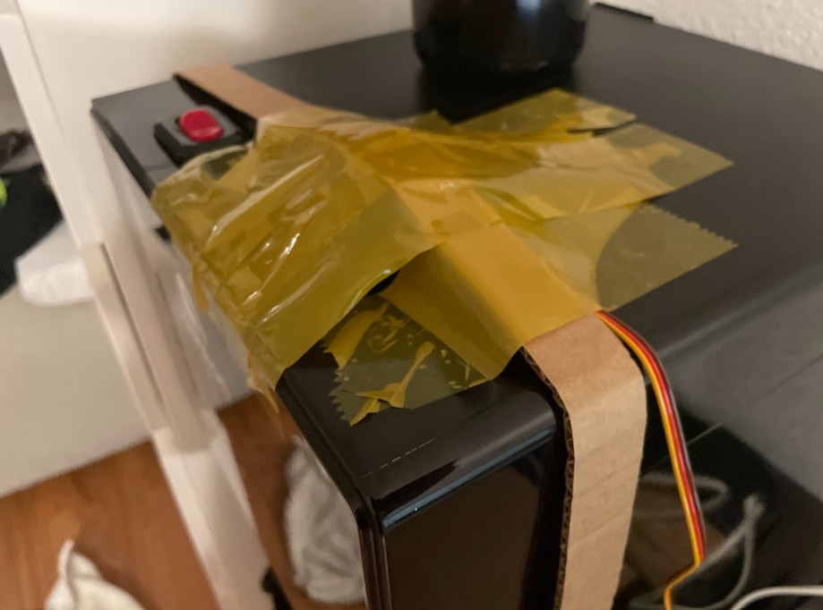

The core problem was finding something strong enough to hold the servo down while it pressed the button. After getting stuck, I asked Claude for help, which suggested using the water dispenser itself as a counterweight. Building on that, I secured the motor with straps that tuck underneath the dispenser, reinforced with tape.

This works via Newton's third law — equal and opposite forces. Since the dispenser holds the motor down, the motor would have to lift the entire dispenser to escape, which isn't possible. In effect, I turned a "hold this down constantly" problem into a "distribute the load across a large, stable mass" problem — the same principle behind bolting heavy machinery to a chassis rather than gluing it to a bench.

[Final Video Demonstration](https://drive.google.com/file/d/1zM2EQMrWdjnH6gU4H7EkNe2uwCsaWLFl/view?usp=sharing)
[Arduino IDE Code](https://github.com/Kqdelol/Automatic-Water-Dispenser/blob/main/water_dispenser.ino)

## Reflection

- Over a week of use, this saved an average of 3 minutes each morning by letting me get ready while the bottle filled.
- The project took longer than expected, with the main obstacles being building the circuit, finding a way to hold the motor down, and getting consistent sensor readings.
- What I learned: basic circuit building, and a lot of general problem-solving and thinking outside the box.

## Future Improvements

- Rebuild cleaner with CAD design and 3D-printed parts instead of cardboard
- Add an AI/computer-vision feature (ESP32-CAM + Raspberry Pi) that automatically detects when a bottle is placed and starts dispensing without a button press
- Add the LCD fill-percentage display and preset fill levels originally planned
